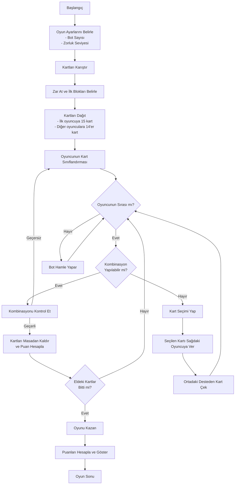

# Periyodik Okey - Oyun Akış Şeması

## Oyun Akışı Detayları

1. **Başlangıç**
   - Oyun başlatılır
   - Ana menüden "Oyuna Başla" seçilir

2. **Oyun Ayarlarını Belirle**
   - Bot sayısı seçilir (1-3)
   - Zorluk seviyesi seçilir (Kolay, Normal, Zor)

3. **Kartları Karıştır**
   - 118 element kartı ve 2 joker kart karıştırılır
   - 7'şer kartlık 17 blok oluşturulur (17 x 7 = 119 kart, 1 kart fazladan kalır)

4. **Zar At ve İlk Blokları Belirle**
   - Zar atılır ve gelen sayı kadar ilerlenir
   - Durulan blok ve fazladan kalan kart ilk oyuncuya verilir

5. **Kartları Dağıt**
   - Kalan bloklar saat yönünde 2 tur dağıtılır
   - İlk oyuncuda 15 kart, diğer oyuncularda 14'er kart olur
   - Geriye kalan bloklar üst üste deste olarak ortaya konur

6. **Oyuncunun Kart Sınıflandırması**
   - Oyuncu elindeki kartları aynı grup veya periyotlara göre sınıflandırır
   - Gruplama yapılırken:
     - Aynı grupta en az 3 kart
     - Aynı periyotta en az 4 kart olmalıdır

7. **Oyun Sırası Kontrolü**
   - Sıra oyuncuda ise hamle yapılır
   - Sıra botta ise bot hamle yapar

8. **Kombinasyon Yapılabilir mi?**
   - Oyuncu elindeki kartlarla kombinasyon yapabiliyorsa "Kontrol Et" butonuna basar
   - Yapamıyorsa kart seçip "Kart Ver" butonuna basar

9. **Kombinasyonu Kontrol Et**
   - Kombinasyon alanındaki kartlar kontrol edilir
   - Geçerli bir kombinasyon ise kartlar masadan kaldırılır ve puan hesaplanır
   - Geçersiz ise kartlar oyuncuya geri verilir

10. **Kart Seçimi**
    - Oyuncu bir kart seçer ve sağdaki bota verir
    - Ortadaki desteden yeni bir kart çeker

11. **Oyun Sonu Kontrolü**
    - Oyuncunun elinde kart kalmadıysa oyun kazanılır
    - Kaldıysa oyun sırası bir sonraki oyuncuya geçer

12. **Puanları Hesapla ve Göster**
    - Grup başına 10 puan
    - Periyot başına 5 puan
    - Son kart joker ise puanlar 2 katına çıkar

13. **Oyun Sonu**
    - Kazanan belirlenir ve puanlar gösterilir
    - Ana menüye dönüş veya yeni oyun seçenekleri sunulur

## Bot Davranışları

### Kolay Seviye Bot
- Rastgele kart seçimi yapar
- Basit kombinasyonlar kurar
- %30 olasılıkla yanlış karar verebilir

### Normal Seviye Bot
- Mantıklı kart seçimleri yapar
- Efektif kombinasyonlar kurmaya çalışır
- %10 olasılıkla yanlış karar verebilir

### Zor Seviye Bot
- Optimal kart seçimleri yapar
- En verimli kombinasyonları kurar
- Rakibin hamlelerine göre stratejisini belirler
- Nadiren hata yapar

## Oyun İçi Kontroller

- **Sol Tık**: Kart seçimi
- **Sürükle-Bırak**: Kartları kombinasyon alanına taşıma
- **Kontrol Tuşu**: Kombinasyonu kontrol etme
- **Boşluk Tuşu**: Ortadaki desteden kart çekme 